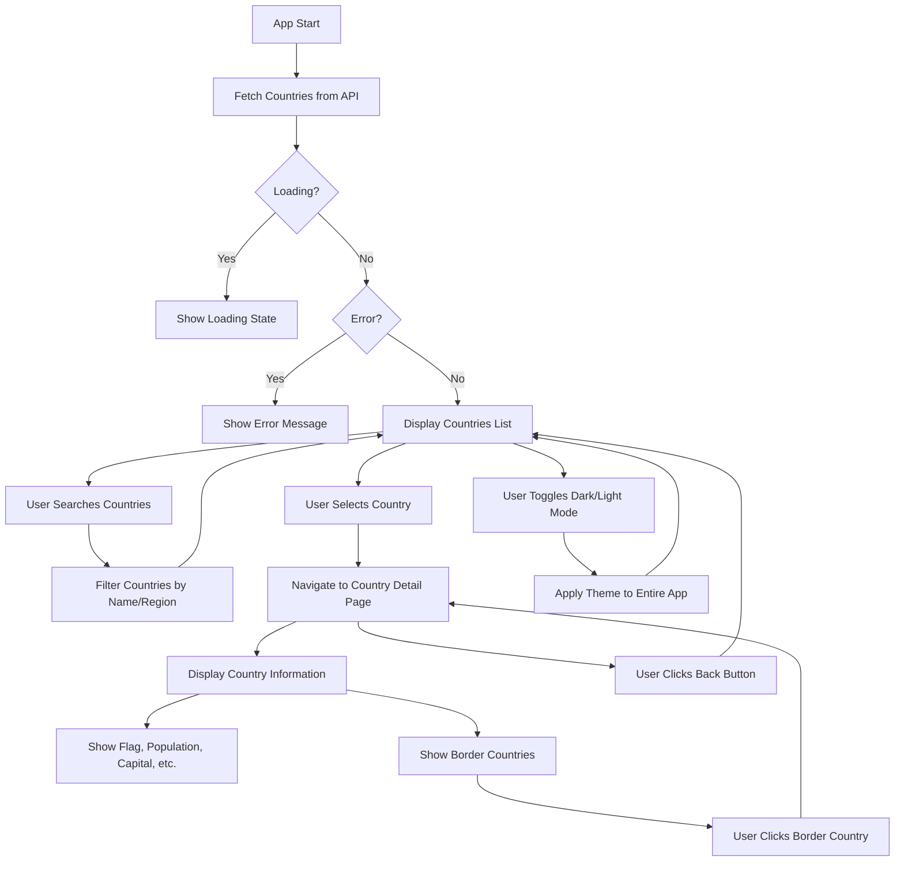

# Quiz app

Specs

- The user is presented with a question: what is the capital of ${country name}

- They are present with 4 choices 

- If the user makes a correct choice - they get a point

- After the response, as new set of options with a new capital is presented

- As soon as the user gets 10 points wins

Business Logic Plan

Fetch Data:

On application load, fetch a list of countries from a reliable API (e.g., REST Countries API).
Extract relevant data such as country names and their capitals.

Game State Management:

Maintain a game state that tracks:

Current score (starts at 0).
Current question (country and its options).
Total questions answered.
Whether the game is over.
Question Generation:

Randomly select a country from the fetched list.

Generate 4 options for the capital:
One correct answer (the selected country's capital).
Three incorrect answers (capitals of other countries).
Shuffle the options to randomize their order.
User Interaction:

Display the question: "What is the capital of [country name]?"
Present the 4 options as clickable buttons.
Answer Validation:

When the user selects an option:

Check if the selected option matches the correct answer.
If correct, increment the score by 1.
If incorrect, provide feedback (optional).
Game Progression:

After each answer:
Display the next question with a new set of options.
Continue until the user reaches 10 points.
Game Completion:

When the user reaches 10 points:
Display a "You Win!" message.
Optionally, allow the user to restart the game.
Error Handling:

Handle API errors gracefully (e.g., show a message if the country data cannot be fetched).
Ensure the game does not crash if there are insufficient countries to generate options.
Optional Enhancements:

Add a timer for each question to increase difficulty.
Track and display the number of questions answered.
Add animations or transitions for better user experience.

## Application Flow

## Features

- Browse all countries with search and filter functionality
- View detailed information about each country
- Navigate between border countries
- Dark/Light theme toggle
- Responsive design